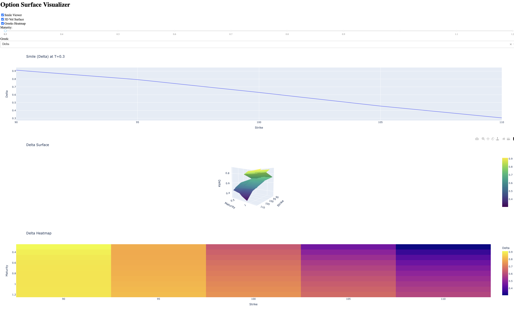

# Java Volatility Surface Builder & Greeks Analyzer

A self-contained tool to reconstruct implied volatility surfaces from market option data, compute Greeks (Delta, Vega, Gamma, Theta), and analyze PnL impact of market shifts.  
Visual exploration is supported via an interactive Python Dash dashboard.

---

## Preview
### Dashboard


---

## Goal

- Build an industrial-style Java pricer core
- Practice implied volatility computation, interpolation, and Greeks (and Java)
- Visualize the volatility smile, surface, and sensitivities
- Quantify PnL moves with both approximation and exact models
- Prepare a codebase ready to plug into a desk-style stack (front/back separation)

---

## Project Structure

```
vol-surface-builder/
├── src/                    # Java source code (organized by module)
│   └── main/java/com/trading/volsurface/
│       ├── BSCalculator.java
│       ├── CsvReader.java
│       ├── GreekPoint.java
│       ├── GreeksSurface.java
│       ├── GreeksSurfaceBuilder.java
│       ├── GreeksSurfaceExporter.java
│       ├── GridGenerator.java
│       ├── InterpolatedIVGridExporter.java
│       ├── IVPoint.java
│       ├── Main.java
|       ├── Option.java
│       ├── PnLCalculator.java
│       ├── StrikeMaturityPoint.java
│       ├── VolatilitySurface.java
│       ├── VolatilitySurfaceAnalyzer.java
│       ├── VolatilitySurfaceBuilder.java
│       └── VolatilitySurfaceExporter.java
│   └── test/java/com/trading/volsurface/
│       └── AppTest.java
├── data/                   # Input CSVs (option market data)
├── output/                 # Exported CSVs (IV surface, Greeks, PnL grid)
├── scripts/                # Dash app for interactive visualization
├── pom.xml                 # Maven project file
└── README.md               # You are here
```

---

## Mathematical Foundations

### Black-Scholes Model

Option pricing is computed using the Black-Scholes formula:

Call option:
```
C = S * N(d1) - K * exp(-rT) * N(d2)
```

Put option:
```
P = K * exp(-rT) * N(-d2) - S * N(-d1)
```

Where:
```
d1 = [ln(S/K) + (r + sigma^2 / 2) * T] / (sigma * sqrt(T))
d2 = d1 - sigma * sqrt(T)
```

- S: underlying price  
- K: strike  
- T: maturity (in years)  
- r: risk-free rate  
- sigma: volatility  
- N(x): standard normal CDF

More: [Wikipedia - Black-Scholes Model](https://en.wikipedia.org/wiki/Black%E2%80%93Scholes_model)

---

### Greeks Calculations

- Delta = dPrice/dS  
- Vega = dPrice/dSigma  
- Gamma = d²Price/dS²  
- Theta = dPrice/dT

Some formulas:

```
Vega  = S * sqrt(T) * phi(d1)
Gamma = phi(d1) / (S * sigma * sqrt(T))
```

Where phi(x) is the standard normal PDF.

More: [Wikipedia - Greeks (finance)](https://en.wikipedia.org/wiki/Greeks_(finance))

---


## Normal distribution CDF

To compute the cumulative distribution function of the standard normal distribution (used in Black-Scholes pricing), we implemented:

    normalCdf(x) = 0.5 * (1 + erf(x / sqrt(2)))

Where `erf(x)` is approximated using a rational approximation from:

Abramowitz and Stegun, *Handbook of Mathematical Functions*, formula 7.1.26  
More: [Wikipedia - Error function](https://en.wikipedia.org/wiki/Error_function#Approximation_with_elementary_functions)

This approximation avoids any external dependencies and allows full portability of the Black-Scholes implementation.

It provides a precision sufficient for financial computation of option prices and Greeks.

---

## PnL Analysis

The project includes both:

- Approximated PnL using:
```
Delta * dS + 0.5 * Gamma * dS^2 + Vega * dSigma
```

- Exact PnL using:
```
PnL = BS(S + dS, sigma + dSigma) - BS(S, sigma)
```

---

## Testing

Basic unit tests via JUnit:
- ATM call delta ≈ 0.5
- Vega, Gamma > 0
- PnL approx ~ PnL exact for small shocks

---

## Dash App (Python)

A Dash dashboard allows:
- Viewing volatility smiles
- 3D implied volatility surface
- Heatmaps of Delta, Vega, Gamma, Theta

Launch with:

```bash
python3 dash_app.py
```

Requirements:
- Python ≥ 3.8
- dash, pandas, plotly, numpy

---

## Future Extensions

- Export REST API
- Integrate live data (e.g. Bloomberg)
- Add SABR calibration
- Monte Carlo pricing over IV grid
- JavaFX GUI

---

## Author

Built as a self-contained reference project for options pricing and Greeks surface modeling.  
Integrable in larger stacks or for educational use.
